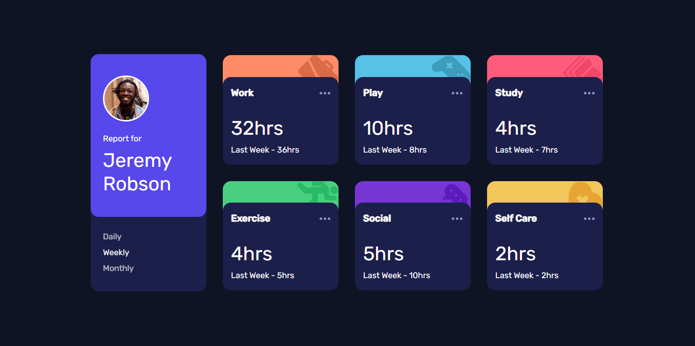

# Frontend Mentor - Time tracking dashboard solution

## Table of contents

- [Overview](#overview)
  - [The challenge](#the-challenge)
  - [Screenshot](#screenshot)
- [My process](#my-process)
  - [Built with](#built-with)
  - [What I learned](#what-i-learned)
  - [Continued development](#continued-development)
- [Author](#author)

## Overview

### The challenge

Users should be able to:

- View the optimal layout for the site depending on their device's screen size
- See hover states for all interactive elements on the page
- Switch between viewing Daily, Weekly, and Monthly stats

### Challenge Screeshot

## My process

### Built with

- Semantic HTML5 markup
- CSS custom properties
- Flexbox
- CSS Grid
- Mobile-first workflow

### What I learned

Every project comes with new challenges and again this challenge doesn't fail to provide one. I think I learned how to use local json file using the fetch api to make it a little interactive.

### Continued development

Again, the learning never stops which is awesome. Going forward, I will be sharpening my overall frontend skills, accessibility, animation etc.

## Author

- George Asiedu - [@george5-star](https://www.frontendmentor.io/profile/george5-star)
